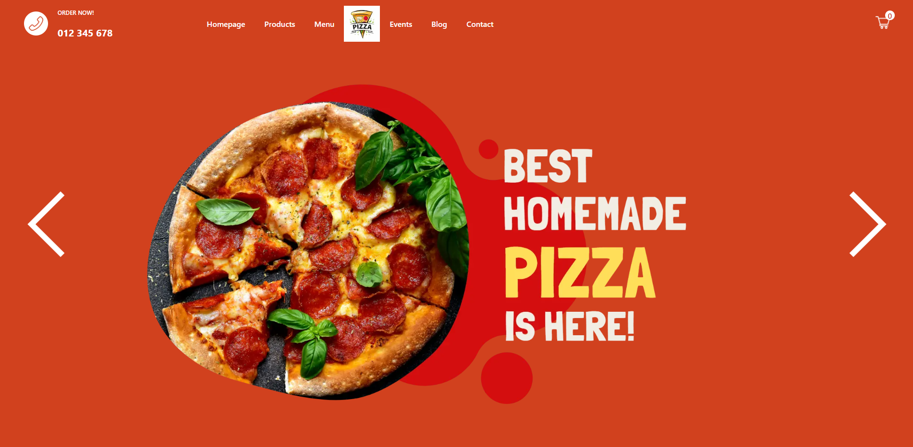
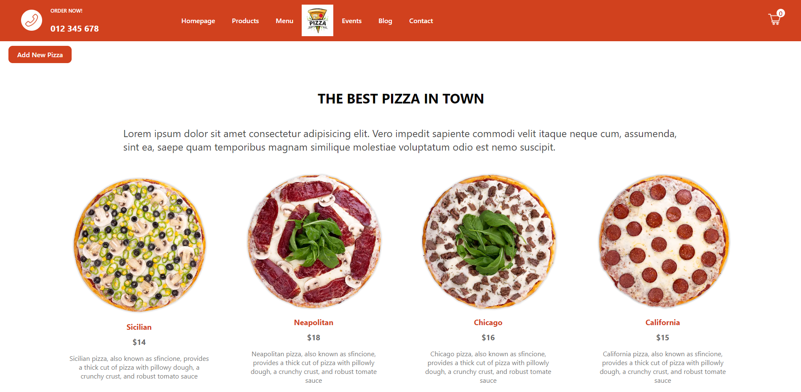
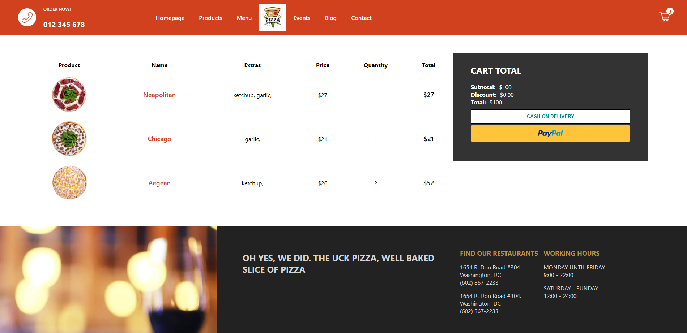
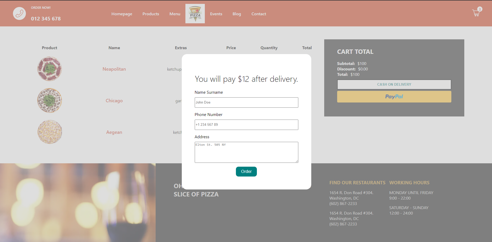
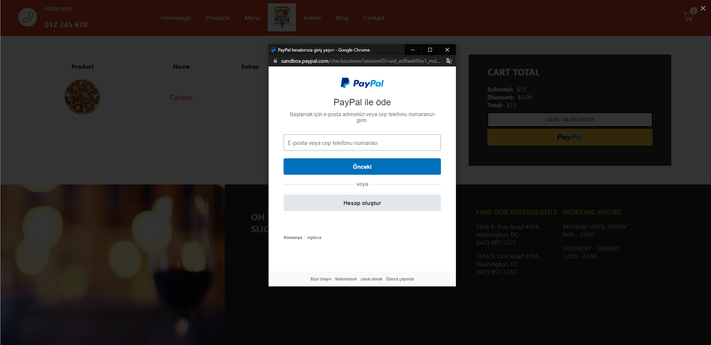
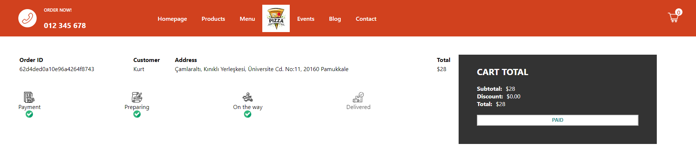
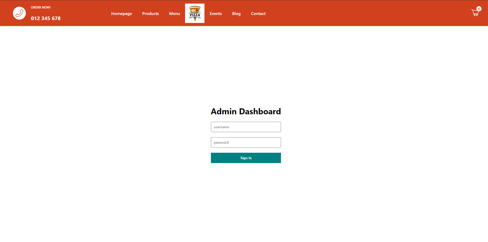
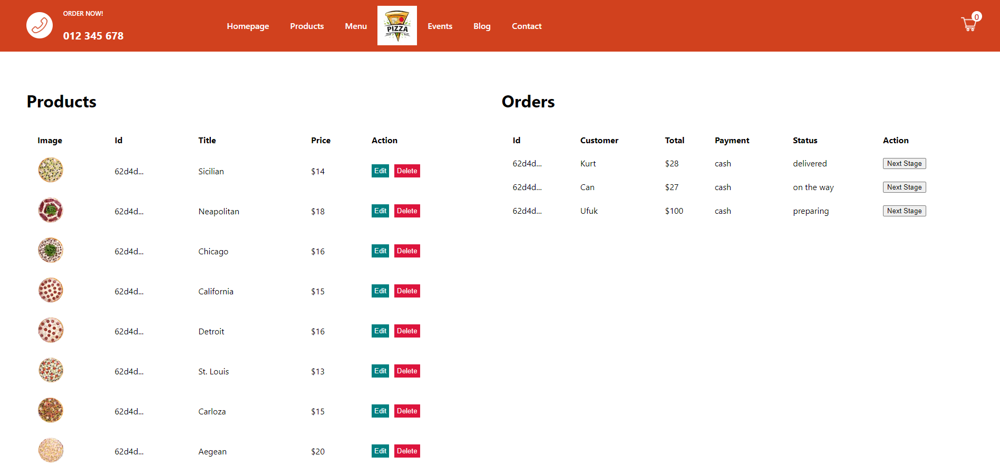

# MERN Food Order App  🍕 🍽

- ***You can place an order as a customer and check the order status. There are two different payment methods. Payment by cash or Paypal.***
- ***İf you want to create new products and view orders. You must log in as an admin.***
- ***If you are logged in as an admin, you can see the "Add New Pizza" button.***
- ***[`Redux`](https://redux.js.org/) used for state management.***


## Built With 🛠
<ul>
<li>
<a target="_blank" href="https://nextjs.org/">Next.js</a>
</li>
<li>
<a target="_blank" href="https://www.mongodb.com/atlas/database">MongoDB</a>
</li>     
<li>
<a target="_blank" href="https://expressjs.com/">Express.js</a>
</li>   
<li>
<a target="_blank" href="https://nodejs.org/en/docs/">Node.js</a>
</li>    
<li>
<a target="_blank" href="https://developer.paypal.com/">Paypal Payment</a>
</li>  
<li>
<a target="_blank" href="https://cloudinary.com/">Cloudinary</a>
</li>  
</ul>


## Installation ⚡

<ul>

<li>
<p>Clone the repo</p>
<pre>
<code>git clone git@github.com:ufukcankurt/nextjs-food-order-app.git</code>
</pre>
</li>
<li>
<p>İnstall all dependencies</p>
<pre>
<code> yarn ||  yarn install </code>
</pre>
</li>
<li>
Create .env file at the top of the application and add these parameters
<pre>
<code> MONGO_URL=</code>
<code> ADMIN_USERNAME=</code>
<code> ADMIN_PASSWORD=</code>
<code> TOKEN=</code>
</pre>
To get MONGO_URL, you must first create a collection in 
<a target="_blank" href="https://www.mongodb.com/atlas/database">MongoDB Atlas</a>. <br> You can create manually the followings: ADMIN_USERNAME - ADMIN_PASSWORD - TOKEN


</li>

<li>
<p>Run the development server:</p>


```bash
npm run dev
# or
yarn dev
```

</li>
</ul>

## Screenshots 📸

<p align="center" style="padding: 10px">


<p align="center" style="padding: 10px">


<p align="center" style="padding: 10px">


<p align="center" style="padding: 10px">


<p align="center" style="padding: 10px">


<p align="center" style="padding: 10px">


> ***The following is for admin only.***

<p align="center" style="padding: 10px">


<p align="center" style="padding: 10px">



